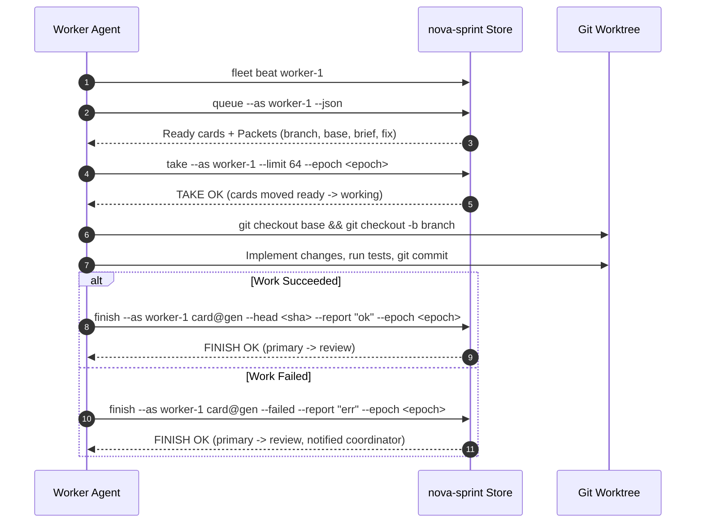
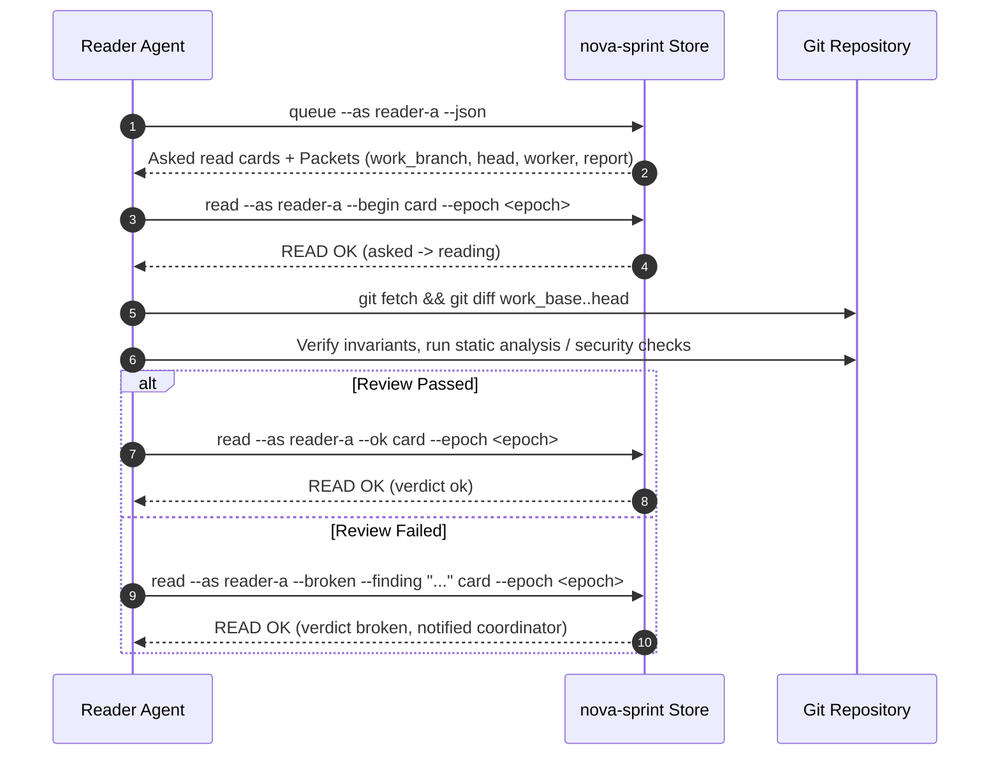
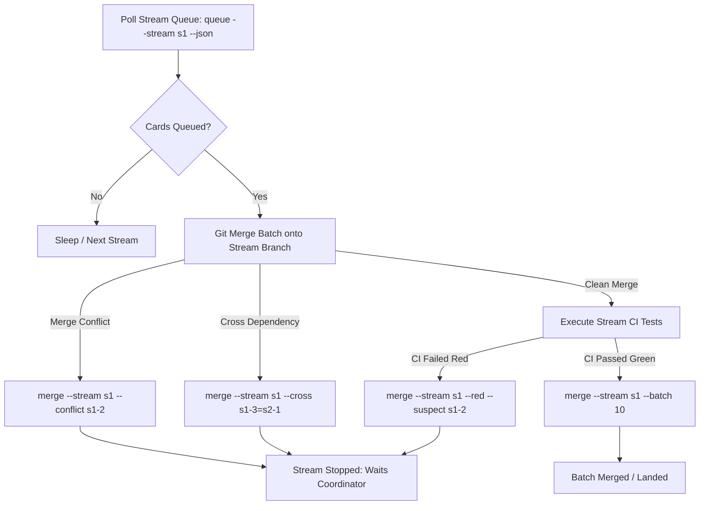

# Real Agent Verb Sequences for Sprint Roles

This specification documents the exact verb sequences, triggers, read/write contracts, CLI invocations, and JSON schemas for outside agents interacting with `nova-sprint`.

These sequences are the direct operational mirror of `internal/sprint/driver/driver.go` (the reference world driver). In production swarms (`nova-swarm`), real autonomous agents replay these exact protocols against the sprint tables.

---

## 1. Architectural Boundaries and Core Invariants

The `nova-sprint` architecture strictly isolates mechanical table transitions, human/coordinator decisions, and external agent execution:

1. **The Machine (`nova-sprint run`, `nova-sprint tick`)**:
   Runs as an internal daemon. Drives automatic column movements (e.g. `waiting` $\rightarrow$ `ready` upon dependency resolution, `ready` $\rightarrow$ `working` upon deal, `merging` $\rightarrow$ `landed` on successful stream merge), cleans up stalled locks, and publishes view updates. Outside agents **never** issue machine verbs (`run`, `tick`).

2. **The Coordinator**:
   Human or supervisor steering. Decides editorial and judgment questions (`accept`, `rework`, `return`, `drop`, `rank`, `resume`, `start`, `stop`, `clear`). Outside worker/reader/merge agents **never** issue coordinator verbs.

3. **Outside Roles (The Real Agents)**:
   Real worker, reviewer, and merge runner agents communicate with the sprint table strictly via external client verbs:
   - **Member (Worker)**: `fleet beat`, `queue --as <member>`, `take --as <member>`, `finish --as <member>`
   - **Reader (Reviewer)**: `queue --as <reader>`, `read --as <reader> --begin`, `read --as <reader> --ok` / `--broken`
   - **Merge Runner**: `queue --stream <stream>`, `merge --stream <stream>` (with outcome flags)
   - **Fleet Lifecycle**: `fleet beat`, silent down (or `fleet down`), `fleet up`

### Core Invariants for Real Agents

- **Epoch Pinning (`--epoch <held>`)**:
  Every write verb MUST supply `--epoch <held>`. The epoch is read once from `where --json` or `queue --json`. If the sprint is cleared (`nova-sprint clear`), any command bearing the old epoch is rejected with:
  `the sprint was cleared at <timestamp>: this driver holds epoch <held>, which the sprint has left`
  Agents encountering this message must halt work on the old epoch and re-read `where`.
- **Card Generations (`<card>@<gen>`)**:
  All work card operations (`take by id`, `finish`) require the exact card generation: `<card>@<gen>` (e.g., `s1-1.w1@2`). If the generation does not match the live assignment in Redis, the verb is refused as stale.
- **Batching and Width**:
  Swarm agents batch transitions. Multi-member operations use comma-separated identifiers (e.g., `--as m1,m2,m3`). Operations are bounded by `Most = 2000` cards per invocation.
- **Actor Identity**:
  Commands take `--actor <name>` (or `NOVA_SPRINT_ACTOR`). For `take`, `finish`, and `read`, `--as <name>` sets the default actor if `--actor` is omitted.
- **Exit Codes**:
  - `0`: Success (verb applied).
  - `1`: Refused (business logic violation, stale epoch/generation, or rejected outcome).
  - `2`: Usage error or store connection failure.

---

## 2. Role 1: Fleet Member Lifecycle Role

The fleet lifecycle manages member liveness, heartbeat telemetry, capacity bounds, and failure recovery.

### Lifecycle Summary Table

| Verb | When (Trigger / Timing) | What it Reads | What it Writes |
|---|---|---|---|
| `fleet beat <member>` | Periodic heartbeat (e.g. every 1s–5s; must not exceed 90s timeout) | Local machine CPU load, system performance metrics | Updates `fleet` table row `load`, heartbeat timestamp, and Redis liveness key |
| Silence (no verb) | Worker process crash, hang, network split, or pause | N/A (inactivity) | Redis heartbeat key expires after 90s; machine marks member `status="down"` and redeals cards |
| `fleet down <member>` | Administrative withdrawal or intentional maintenance hold | Member record in `fleet` table | Sets member `status="down"` in `fleet` table; halts card deals to member |
| `fleet up <member>` | Member boot, restart, network restoration, or capacity adjustment | Member row in `fleet` table | Sets `status="up"`, configures concurrent `width`, allows card dealing |

### Detailed Verb Sequences & Invocations

#### 1. Heartbeat (`fleet beat`)
A running worker issues `fleet beat` continuously. Real agents omit `--load` to let `nova-sprint` sample host CPU usage, or provide a sampled float.

```bash
# Standard periodic heartbeat
nova-sprint fleet beat worker-1 --redis 127.0.0.1:6379

# Heartbeat with explicit load and JSON response
nova-sprint fleet beat worker-1 --load 24.5 --json --redis 127.0.0.1:6379
```

**JSON Response Schema:**
```json
{
  "member": "worker-1",
  "at": "2026-09-30T14:15:00Z",
  "load": 24.5,
  "last": 21.0,
  "how": "sampled"
}
```

#### 2. Down / Silence
In standard operation, downtime is natural: the agent process terminates or halts, stopping heartbeats. After 90 seconds without a beat, the sprint engine detects expiration and changes member status to `down`.

For immediate administrative suspension (e.g. before bench shutdown or during hold):
```bash
nova-sprint fleet down worker-1 --epoch 12 --redis 127.0.0.1:6379
```
**Output:**
```
FLEET-DOWN OK worker-1 changed=1
```

#### 3. Recovery (`fleet up`)
When an agent starts or recovers from downtime, it registers as `up` and declares its concurrent execution width (default 64):
```bash
nova-sprint fleet up worker-1 --width 64 --epoch 12 --redis 127.0.0.1:6379
```
**Output:**
```
FLEET-UP OK worker-1 changed=1
```

---

## 3. Role 2: Member Role (Worker)

Workers consume work cards from their dealt queue, execute code tasks in isolated worktrees, and report results back to the table.

### Worker Summary Table

| Verb | When (Trigger / Timing) | What it Reads | What it Writes |
|---|---|---|---|
| `fleet beat <member>` | Loop start / heartbeat interval | System load metrics | Liveness timestamp and CPU load in `fleet` table |
| `queue --as <member> --json` | Each worker loop poll when member has idle capacity | Member's assigned cards in `ready` and `working` columns | None (read-only query) |
| `take --as <member> --limit <n>` | When cards exist in `ready` column up to member's width | Member's ready cards, assignment generations | Moves cards `ready` $\rightarrow$ `working` in `fleet` table; sets `taken` timestamp |
| `finish --as <member> <card>@<gen>...` | Immediately upon successful execution of work task | Git commit SHA (`head`), work tree test/build logs | Moves primary `working` $\rightarrow$ `review` in `work` table; records `ok` in `fleet` |
| `finish --as <member> <card>@<gen>... --failed` | Immediately upon terminal error or test failure | Error trace, test failure logs, failure description | Moves primary `working` $\rightarrow$ `review` in `work`; marks `failed`; notifies coordinator |

### Detailed Verb Sequences & Workflows



#### 1. Polling Queue (`queue --as <member>`)
The worker inspects assigned work:
```bash
nova-sprint queue --as worker-1 --json --redis 127.0.0.1:6379
```

**JSON Response Schema:**
```json
{
  "as": "worker-1",
  "stream": "",
  "epoch": 12,
  "cards": [
    {
      "id": "s1-1.w1",
      "table": "fleet",
      "row": "worker-1",
      "col": "ready",
      "primary": "s1-1",
      "stream": "s1",
      "attempt": 1,
      "gen": 1,
      "score": 10.0,
      "dealt": "2026-09-30T14:10:00Z",
      "packet": {
        "card": "s1-1.w1",
        "kind": "work",
        "as": "worker-1",
        "primary": "s1-1",
        "stream": "s1",
        "attempt": 1,
        "gen": 1,
        "epoch": 12,
        "brief": "Implement auth token rotation",
        "fix": "",
        "notes": [],
        "branch": "sprint/s1-1.w1",
        "base": "main"
      }
    }
  ]
}
```

#### 2. Taking Work (`take`)
Workers claim cards in batch up to their allowed concurrency width:
```bash
# Batch take by limit (recommended)
nova-sprint take --as worker-1 --limit 64 --epoch 12 --redis 127.0.0.1:6379

# Take explicit card by generation
nova-sprint take --as worker-1 s1-1.w1@1 --epoch 12 --redis 127.0.0.1:6379

# Multi-member swarm batch take
nova-sprint take --as worker-1,worker-2 --limit 64 --epoch 12 --redis 127.0.0.1:6379
```
**Output:**
```
TAKE OK moved=1 refused=0
```

#### 3. Reporting Completion (`finish`)
Once git operations and test runs conclude, the worker commits the outcome:

**Success (OK):**
```bash
nova-sprint finish --as worker-1 s1-1.w1@1 \
  --head 4b825dc6 \
  --branch sprint/s1-1.w1 \
  --base main \
  --report "unit tests passed 48/48" \
  --epoch 12 \
  --redis 127.0.0.1:6379
```

**Failure:**
```bash
nova-sprint finish --as worker-1 s1-1.w1@1 \
  --failed \
  --head 4b825dc6 \
  --report "compilation failed: undefined symbol TokenKey in auth.go:88" \
  --epoch 12 \
  --redis 127.0.0.1:6379
```

**Multi-card Batch Finish:**
```bash
nova-sprint finish --as worker-1 s1-1.w1@1 s1-2.w1@1 --epoch 12 --redis 127.0.0.1:6379
```
**Output:**
```
FINISH OK moved=2 refused=0
```

---

## 4. Role 3: Reader Role (Reviewer)

Readers perform independent reviews of completed work cards in `review`. Each card requires two distinct readers to mark it `ok` at the current commit head before it can be accepted for merging.

### Reader Summary Table

| Verb | When (Trigger / Timing) | What it Reads | What it Writes |
|---|---|---|---|
| `queue --as <reader> --json` | Periodic reader review poll | Read cards in `asked` and `reading` columns | None (read-only query) |
| `read --as <reader> --begin [<card>...]` | When cards appear in reader's `asked` column | `asked` cards and embedded work metadata | Moves cards `asked` $\rightarrow$ `reading` in `readers` table; sets `begun` timestamp |
| `read --as <reader> --ok <card>...` | When evaluation passes all review checks | Git diff between base and head, test output | Sets card verdict to `ok` in `readers` table; advances review approval count |
| `read --as <reader> --broken --finding <text> <card>...` | When evaluation finds a bug, broken invariant, or regression | Audit findings, test failures, or lint issues | Sets card verdict to `broken` with finding text; notifies coordinator for rework |

### Detailed Verb Sequences & Workflows



#### 1. Polling Review Queue (`queue --as <reader>`)
```bash
nova-sprint queue --as reader-a --json --redis 127.0.0.1:6379
```

**JSON Response Schema:**
```json
{
  "as": "reader-a",
  "stream": "",
  "epoch": 12,
  "cards": [
    {
      "id": "s1-1.r1.reader-a",
      "table": "readers",
      "row": "reader-a",
      "col": "asked",
      "primary": "s1-1",
      "stream": "s1",
      "attempt": 1,
      "head": "4b825dc6",
      "asked": "2026-09-30T14:12:00Z",
      "packet": {
        "card": "s1-1.r1.reader-a",
        "kind": "read",
        "as": "reader-a",
        "primary": "s1-1",
        "stream": "s1",
        "attempt": 1,
        "epoch": 12,
        "worker": "worker-1",
        "head": "4b825dc6",
        "work_branch": "sprint/s1-1.w1",
        "work_base": "main",
        "report": "unit tests passed 48/48"
      }
    }
  ]
}
```

#### 2. Beginning Review (`read --begin`)
Moves cards from `asked` to `reading`:
```bash
# Single card
nova-sprint read --as reader-a --begin s1-1.r1.reader-a --epoch 12 --redis 127.0.0.1:6379

# Multi-reader batch begin
nova-sprint read --as reader-a,reader-b --begin s1-1.r1.reader-a s1-1.r1.reader-b --epoch 12 --redis 127.0.0.1:6379
```
**Output:**
```
READ OK moved=1 refused=0
```

#### 3. Reporting Findings (`read --ok` / `read --broken`)

**Acceptance (OK):**
```bash
nova-sprint read --as reader-a --ok s1-1.r1.reader-a --epoch 12 --redis 127.0.0.1:6379
```

**Rejection (Broken):**
```bash
nova-sprint read --as reader-a --broken \
  --finding "missing nil check when parsing optional claims token" \
  s1-2.r1.reader-a \
  --epoch 12 \
  --redis 127.0.0.1:6379
```

**Multi-card Batch Report:**
```bash
nova-sprint read --as reader-a --ok s1-1.r1.reader-a s1-3.r1.reader-a --epoch 12 --redis 127.0.0.1:6379
```
**Output:**
```
READ OK moved=2 refused=0
```

---

## 5. Role 4: Merge Role (Coordinator / Stream Merge Agent)

The merge runner monitors stream merge queues, integrates candidate card branches into stream integration branches, executes automated CI verification, and reports one of five explicit outcomes.

### Merge Runner Summary Table

| Verb | When (Trigger / Timing) | What it Reads | What it Writes |
|---|---|---|---|
| `queue --stream <stream> --json` | Periodic merge cycle for active streams (`state != "stopped"` and `!= "landed"`) | Primaries in `queued` column of `merge` table for stream | None (read-only query) |
| `where --json` | Start of merge loop and after each step | Stream states, active epochs, machine run state | None (read-only query) |
| `merge --stream <s> [--batch <n>]` | Batch cleanly merges into stream branch and stream CI passes green | Git merge tree, green CI build logs | Advances cards `queued` $\rightarrow$ `merged` in `merge` table; triggers landing |
| `merge --stream <s> --conflict <card>` | Specific card in batch encounters git merge conflict | Git merge conflict log identifying conflicting file/card | Marks conflicting card `stuck`; sets stream `state="stopped"`; alerts coordinator |
| `merge --stream <s> --cross <card>=<other>` | Card requires unlanded card from another stream first | Cross-stream dependency graph / analysis | Stops stream; registers cross-stream dependency block for coordinator sequencing |
| `merge --stream <s> --red [--suspect <c>...]` | Batch merges cleanly but stream branch CI tests fail | CI test failure logs; suspect card commit diffs | Sets stream `state="stopped"` (red branch); records suspects; notifies coordinator |
| `merge --stream <s> --rejected` | Merge queue engine rejects batch execution | Rejection reason from merge controller | Sets stream `state="stopped"` with rejected status |

### Detailed Verb Sequences & Invocations



#### 1. Polling Stream Merge Queue
```bash
nova-sprint queue --stream s1 --json --redis 127.0.0.1:6379
```

**JSON Response Schema:**
```json
{
  "as": "",
  "stream": "s1",
  "epoch": 12,
  "cards": [
    {
      "id": "s1-1",
      "table": "merge",
      "row": "s1",
      "col": "queued",
      "score": 10.0
    },
    {
      "id": "s1-2",
      "table": "merge",
      "row": "s1",
      "col": "queued",
      "score": 9.5
    }
  ]
}
```

#### 2. Reporting Outcomes (The Five Mutually Exclusive Cases)

1. **Clean Merge (Green / OK):**
   ```bash
   nova-sprint merge --stream s1 --batch 10 --epoch 12 --redis 127.0.0.1:6379
   ```
   **Output:**
   ```
   MERGE OK moved=2 refused=0
   ```

2. **Merge Conflict:**
   ```bash
   nova-sprint merge --stream s1 --batch 10 \
     --conflict s1-2 \
     --note "conflict in internal/sprint/store/redis.go with main" \
     --epoch 12 \
     --redis 127.0.0.1:6379
   ```
   **Output:**
   ```
   MERGE OK moved=1 refused=0
   ```
   *(Stream `s1` stops. Card `s1-2` becomes `stuck`. Coordinator receives judgment notification).*

3. **Cross-Stream Dependency:**
   ```bash
   nova-sprint merge --stream s1 --batch 10 \
     --cross s1-3=s2-5 \
     --note "s1-3 requires types exported by unlanded s2-5" \
     --epoch 12 \
     --redis 127.0.0.1:6379
   ```
   **Output:**
   ```
   MERGE OK moved=1 refused=0
   ```

4. **CI Red (Branch Test Failure):**
   ```bash
   nova-sprint merge --stream s1 --batch 10 \
     --red \
     --suspect s1-2 \
     --note "integration test TestConcurrentReads failed on stream branch" \
     --epoch 12 \
     --redis 127.0.0.1:6379
   ```
   **Output:**
   ```
   MERGE OK moved=1 refused=0
   ```
   *(Stream `s1` stops: `stream branch red`. Suspect cards isolated. Coordinator prompted for `return` and `resume`).*

5. **Batch Rejected:**
   ```bash
   nova-sprint merge --stream s1 --batch 10 \
     --rejected \
     --note "branch protection requires signed commits" \
     --epoch 12 \
     --redis 127.0.0.1:6379
   ```
   **Output:**
   ```
   MERGE OK moved=1 refused=0
   ```

---

## 6. Real Swarm Agent Replay Recipes

Below are direct bash automation patterns suitable for production agent loops.

### Worker Agent Loop (`worker-loop.sh`)

```bash
#!/usr/bin/env bash
set -euo pipefail

MEMBER="${1:-worker-1}"
REDIS="${NOVA_SPRINT_REDIS:-127.0.0.1:6379}"

while true; do
  # 1. Heartbeat
  nova-sprint fleet beat "$MEMBER" --redis "$REDIS" >/dev/null

  # 2. Check view & epoch
  WHERE_JSON=$(nova-sprint where --json --redis "$REDIS")
  EPOCH=$(echo "$WHERE_JSON" | jq -r '.epoch')
  MACHINE=$(echo "$WHERE_JSON" | jq -r '.machine // ""')
  if [[ "$MACHINE" != *"running"* ]]; then
    echo "Machine not running ($MACHINE), sleeping..."
    sleep 5
    continue
  fi

  # 3. Read assigned queue
  Q_JSON=$(nova-sprint queue --as "$MEMBER" --json --redis "$REDIS")
  READY_COUNT=$(echo "$Q_JSON" | jq '[.cards[] | select(.col=="ready")] | length')

  if (( READY_COUNT > 0 )); then
    # 4. Take cards up to member width
    nova-sprint take --as "$MEMBER" --limit 64 --epoch "$EPOCH" --redis "$REDIS"

    # 5. Process working cards
    Q_WORKING=$(nova-sprint queue --as "$MEMBER" --json --redis "$REDIS")
    echo "$Q_WORKING" | jq -c '.cards[] | select(.col=="working")' | while read -r card; do
      CID=$(echo "$card" | jq -r '.id')
      GEN=$(echo "$card" | jq -r '.gen')
      BRANCH=$(echo "$card" | jq -r '.packet.branch')
      BASE=$(echo "$card" | jq -r '.packet.base')
      BRIEF=$(echo "$card" | jq -r '.packet.brief')

      echo "Executing $CID@$GEN on $BRANCH from $BASE..."

      # Real git/build work here:
      # git checkout "$BASE" && git checkout -B "$BRANCH"
      # ... perform task ...
      # HEAD_SHA=$(git rev-parse HEAD)

      HEAD_SHA="c0ffee12" # simulated commit
      nova-sprint finish --as "$MEMBER" "${CID}@${GEN}" \
        --head "$HEAD_SHA" \
        --report "completed: $BRIEF" \
        --epoch "$EPOCH" \
        --redis "$REDIS"
    done
  fi

  sleep 1
done
```

### Reviewer Agent Loop (`reader-loop.sh`)

```bash
#!/usr/bin/env bash
set -euo pipefail

READER="${1:-reader-a}"
REDIS="${NOVA_SPRINT_REDIS:-127.0.0.1:6379}"

while true; do
  WHERE_JSON=$(nova-sprint where --json --redis "$REDIS")
  EPOCH=$(echo "$WHERE_JSON" | jq -r '.epoch')

  # 1. Inspect queue
  Q_JSON=$(nova-sprint queue --as "$READER" --json --redis "$REDIS")

  # 2. Begin all asked cards
  ASKED_IDS=$(echo "$Q_JSON" | jq -r '[.cards[] | select(.col=="asked") | .id] | join(" ")')
  if [[ -n "$ASKED_IDS" ]]; then
    nova-sprint read --as "$READER" --begin $ASKED_IDS --epoch "$EPOCH" --redis "$REDIS"
  fi

  # 3. Evaluate reading cards
  Q_READING=$(nova-sprint queue --as "$READER" --json --redis "$REDIS")
  echo "$Q_READING" | jq -c '.cards[] | select(.col=="reading")' | while read -r card; do
    RCARD=$(echo "$card" | jq -r '.id')
    WORK_BRANCH=$(echo "$card" | jq -r '.packet.work_branch')
    HEAD_SHA=$(echo "$card" | jq -r '.packet.head')

    # Real audit / verification here:
    # git diff ...
    IS_OK=1

    if (( IS_OK == 1 )); then
      nova-sprint read --as "$READER" --ok "$RCARD" --epoch "$EPOCH" --redis "$REDIS"
    else
      nova-sprint read --as "$READER" --broken --finding "invariant failed" "$RCARD" --epoch "$EPOCH" --redis "$REDIS"
    fi
  done

  sleep 1
done
```

---

## 7. Cleared Epoch Recovery Contract

If a coordinator issues `nova-sprint clear --confirm sprint`, the epoch increments, all cards are cleared, and existing leases vanish.

When any worker, reader, or merge verb receives:
```
exit 1: the sprint was cleared at <timestamp>: this driver holds epoch <old>, which the sprint has left
```

The agent MUST:
1. Immediately abandon in-flight commits and branches for the stale epoch.
2. Stop re-trying the command with the old epoch.
3. Query `nova-sprint where --json` to detect whether a new epoch has started.
4. If a new sprint is running under the new epoch, re-register via `fleet up <member> --epoch <new>` and resume queue polling under `<new>`.
