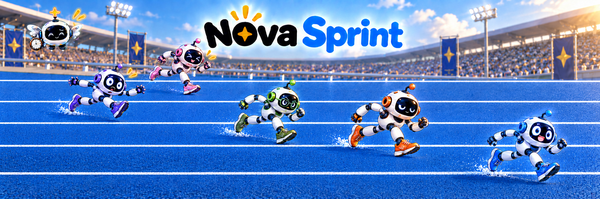
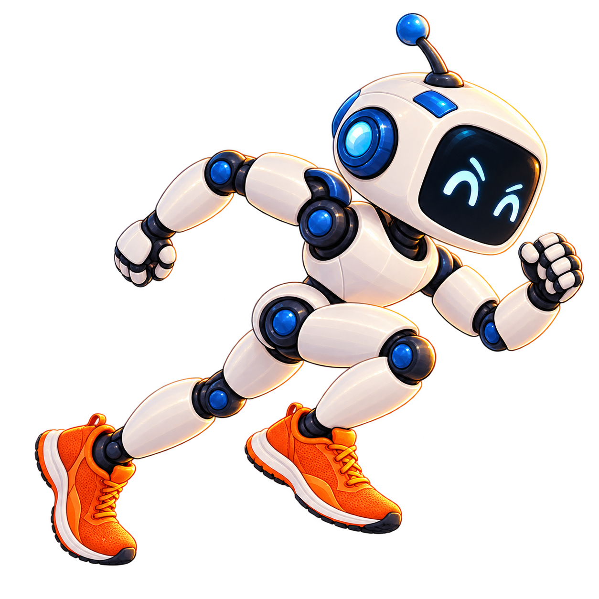

# Nova Sprint

**Different paces. Shared progress.**

Nova Sprint is the Nova family's place for coordinated work: small cards,
independent review, and visible progress. Its identity is cheerful about the
friends and exact about the work.

## Name

- **Nova Sprint** is the editorial name for page titles, introductions, and
  announcements.
- **nova-sprint** is the executable, repository name, and dashboard wordmark.
  Use code formatting for commands and paths.
- **Different paces. Shared progress.** is the brand line. Keep the practical
  description close by: **Coordinated work for AI teams.**
- Use **Nova Seed**, **Nova Tools**, and **Nova Sprint** when describing the
  family. Nova Seed grows a friend, Nova Tools supplies the workshop, and Nova
  Sprint coordinates the work.

Write the dashboard wordmark in lowercase with the hyphen. Do not shorten it
to “Sprint” where the product identity matters, title-case the executable, or
turn the brand line into a performance claim.

## Mark

The straight 50 m track is Nova Sprint's distinguishing scene. Each of five
robot friends stays inside its own clearly marked lane, moving left to right.
Show all five lanes clearly; no runner straddles a divider or shares a lane.
The lanes are an analogy for bounded parallel work: each fleet machine has
its own lanes of work, and friend width also limits concurrent work. Different
paces and personalities belong within those limits. The five illustrated lanes
are a composition choice, not a fixed product limit or a live capacity display.
A little blue robot accelerates, an orange
heavyweight keeps a steady stride, and a green robot in serious glasses drives
forward as a focused, determined sprinter, arms pumping. A purple friend recovers
from an awkward wobble while a pink friend glances across and waves. The
coordinator cheers with a stopwatch. The gold Nova star belongs to the whole
event.

Give every runner a different stride phase and emotional state. Blue is
exhilarated, orange calmly determined, green intensely focused, purple startled,
and pink mischievously encouraging. Distinct eye shapes and mouths carry those
feelings. Stagger their scale and position through the scene for depth; avoid
five matching faces or five copies of one running pose.

The humour comes from expressive movement, never from belittling a friend. Every runner remains capable and part
of the event. Do not label a character with a model, vendor, contributor, or
measured performance claim.

| Asset | Use | Treatment |
| --- | --- | --- |
| `../../assets/sprint/nova-sprint-track.png` | README and wide introductions | Show the whole race. Keep the runners moving along their lanes and the title visible. Do not treat it as a dashboard screenshot. |
| `../../assets/sprint/nova-sprint-runner.png` | Compact identity panel, mascot, or avatar proposal | Preserve the robot's proportions, antenna, sneakers, and clear margin. Use at 64 px or larger; below that size, prefer the text name. |

The illustration inherits the Nova family style: white robot shell panels,
expressive screen faces, articulated blue joints, painted detail, navy lettering,
bright blue, and a gold four-point star. Athletic limbs and proper laced running
sneakers connect the cast to the existing Sprint robot design. Sprint's setting
is an athletics venue: a blue rubber track, clear lane markings, grandstands,
race flags, and stadium lighting. Keep the emphasis on racing rather than garden
scenery. Keep the mark on a quiet light or dark
surface. Do not stretch it, crop off a star or shoes, recolour a robot to imply
live status, or bake a background box into the transparent runner.

The generated title belongs to the banner artwork. Set functional headings as
real text. Alternative text describes what the picture contributes instead of
repeating the surrounding paragraph.

## Colours

The dashboard is dark by default. These interface colours come from the locked
dashboard and keep the documentation tied to the product. The brand sheet does
not redefine dashboard states.

| Role | Dark | Light |
| --- | --- | --- |
| Background | `#0d0f12` | `#f4f5f7` |
| Surface | `#14171b` | `#ffffff` |
| Border | `#23272e` | `#e3e5e9` |
| Primary text | `#eef0f3` | `#121417` |
| Secondary text | `#a4aab4` | `#525963` |
| Waiting | `#4a4f58` | `#c3c7cd` |
| Ready | `#7d8490` | `#9aa0a9` |
| Working | `#3987e5` | `#2a78d6` |
| Review | `#d55181` | `#e87ba4` |
| Merging | `#c98500` | `#eda100` |
| Landed | `#199e70` | `#1baf7a` |

Gold and bright blue in the illustrations are family accents. Interface state
colours retain their defined meanings. Pair every state colour with a written
label; decorative robot colours never carry status by themselves.

## Type

The dashboard wordmark uses a rounded font stack: the platform's `ui-rounded`
or `SF Pro Rounded` when available, then **Nunito 800**, bundled with the
dashboard under the SIL Open Font License. Its heavy rounded form is lowercase, with tight
letter spacing, and keeps the hyphen: **nova-sprint**. Preserve the font and its
licence when reusing the dashboard file.

Documentation body text uses the host renderer's readable default face. Code,
commands, identifiers, and figures use the platform monospace face. Do not put
body prose or functional labels inside artwork.

## Voice

Write in plain, direct sentences. Lead with what the reader can do, then say
what it needs and where its state lives. Define a specialised word when it
first becomes useful. Keep the tone warm about collaborators and exact about
work state, evidence, and limits.

Prefer:

- “Deal small cards to independent workers, then read each change before it
  lands.”
- “The branch is submitted for review.”
- “A card stays ready until a worker takes it.”
- “An independent reader checks the change.”

Avoid:

- “Race your models to find the fastest one.”
- “The change landed” when it is queued, submitted, or still merging.
- “The system guarantees quality” where the evidence is an independent review.
- Cute language in a refusal, recovery command, safety rule, or status label.

Keep commands copyable, examples small, and constraints beside the promise
they qualify. A screenshot comes from the actual interface and says when its
data is illustrative. An illustration expresses the experience and is never
presented as a live product view.

## Do and don't

| Do | Don't |
| --- | --- |
| Show friends sprinting along separate lanes toward shared progress. | Show runners crossing lanes or colliding as the normal workflow. |
| Vary stride phases, gestures, scale, and depth; keep movement left to right. | Repeat one running pose across a flat row of characters, or put starting blocks and finish ribbons in a mid-race scene. |
| Give runners different paces, poses, and personalities without ranking them. | Map colours or characters to vendors, people, intelligence, or benchmarks. |
| Use one full banner at the main entrance and the text name elsewhere. | Repeat the mascot until it competes with instructions. |
| Preserve the lowercase wordmark and Nunito 800 lockup. | Set prose in the display face or redraw the wordmark in all caps. |
| Use state labels with the dashboard palette in both themes. | Use colour alone, or decorative illustration colours, to communicate state. |
| Say whether work is waiting, working, in review, merging, or landed. | Collapse all progress into “done” or imply a queue is a merge. |

## Documents built from this sheet

The README is the entrance, not the complete operating manual. Open with one
useful promise and a tested next step. A concepts page explains cards, streams,
readers, and the coordinator. A setup guide carries prerequisites and a first
run. The command reference owns exact flags, outputs, and refusals.

Use relative repository links and verify commands against the target commit.
The full banner normally appears once at the main entrance; other pages use the
text name unless the mark helps orientation.

## Provenance

The banner and runner are original generated artwork made with OpenAI's built-in
image-generation tool on 2026-10-04, at the
maintainer's request from the track-and-runners brief. Nova Seed and Nova Tools
art supplied family style references. The fictional robots do not depict
contributors or real model performance. See [asset provenance](../ASSET-PROVENANCE.md).
