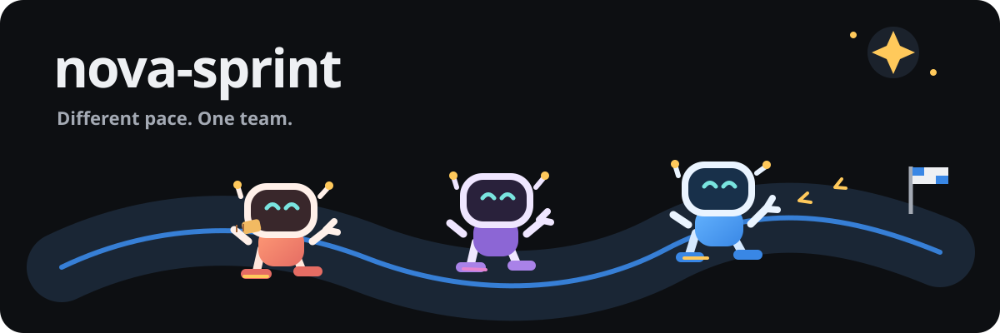

# nova-sprint brand

Nova is the seed, Nova Tools is the workshop, and nova-sprint is the race: a
friendly way to move well-described work through its checks and handoffs. The
race is about the work moving, not about ranking the friends doing it.

## Name

Write the product name as **nova-sprint**: lowercase, with one hyphen. Keep it
as one name in prose, command examples, links and headings. In a wordmark, set
it in Nunito ExtraBold (800), with the hyphen at the normal word height and
spacing. Give the name breathing room; do not split it across a line or make
"sprint" a separate product.

## Mark

The original header illustration above is the sprint mark. Its curved lane
borrows Nova's star and rounded, cheerful workshop feeling, then gives the
scene to robot friends moving at their own pace. The snack is a small joke
about taking breaks, not a prize for coming first. Keep the art intact, with
enough space around it to read at page width; use the plain
wordmark when the image would be too small to read. The art is original vector
work and its provenance is recorded in [`docs/ASSET-PROVENANCE.md`](../ASSET-PROVENANCE.md).

## Colours

The dashboard stays dark, as its page specification requires. Its dark
surfaces and status colors are the working palette; the light values below
are for print, presentations and pages that cannot use the dashboard's dark
surface. Status colors keep the same meaning in either setting.

| Role | Dark | Light |
| --- | --- | --- |
| Page background | `#0d0f12` | `#f7f5f0` |
| Raised surface | `#14171b` | `#fffdfa` |
| Border | `#23272e` | `#d9dde4` |
| Primary text | `#eef0f3` | `#202630` |
| Secondary text | `#a4aab4` | `#596574` |
| Track and ready | `#7d8490` | `#687484` |
| Working blue | `#3987e5` | `#236db5` |
| Review pink | `#d55181` | `#ad3c68` |
| Merging amber | `#c98500` | `#986000` |
| Landed green | `#199e70` | `#137b58` |
| Nova star | `#ffc95b` | `#a96a00` |

Keep text readable against its surface, and pair a status color with its state
label. Do not use color alone to tell a reader what happened.

## Type

Use the bundled **Nunito ExtraBold 800** for the lowercase wordmark; it is the
dashboard's existing wordmark face and its SIL Open Font License is beside the
font in `internal/sprintdash/page/OFL.txt`. Use a system sans-serif for body
copy and headings, and the system monospace face for commands, hashes, and
measured values. Keep command names and data in their literal spelling.

## Voice

Be warm, direct, and specific. Explain the state, the rule that moved it, and
the next action a reader can take. Let the joke land on the familiar chaos of
coordination—lost shoes, snack breaks, tangled dependencies—not on a friend's
model, harness, pace, or worth. Describe what the machine records and checks;
do not imply that it knows more than the recorded evidence.

## Do and don't

| Do | Don't |
| --- | --- |
| “The dependency is still open. Pink can take the next ready card while it clears.” | “The slow model is holding the team back.” |
| “The attempt passed its checks and is waiting for review.” | “The friend is definitely done; the green badge says so.” |
| “Three friends, three paces, one finish line.” | “Real teammates finish first.” |
| “No fresh read is recorded yet; check the sprint server.” | “Everything is fine.” |

Use playful illustrations as an invitation, then make the status and remedy
plain. Keep people and AI friends welcome, and make room for a careful pace.
